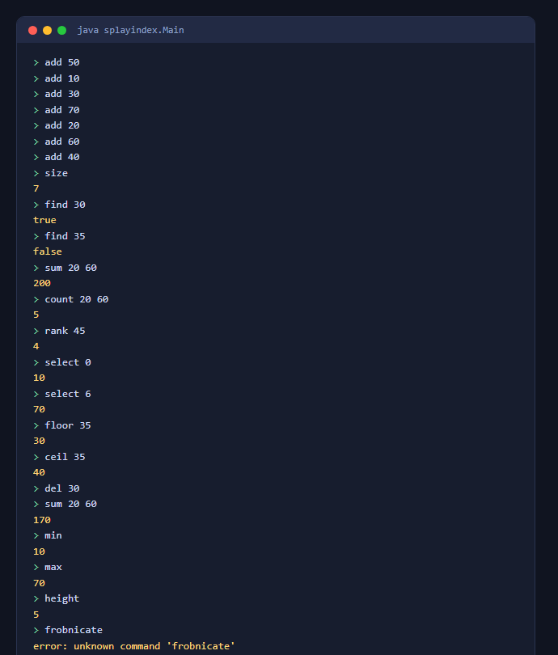
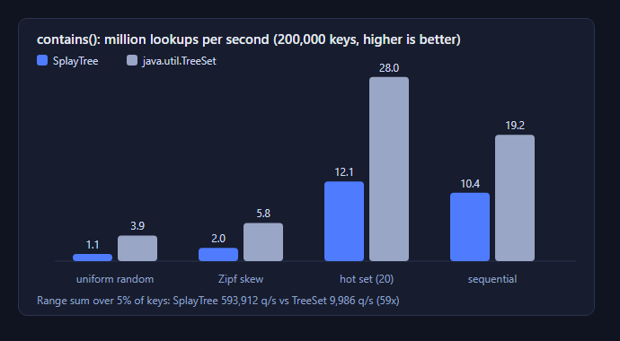

# SplayIndex


An ordered set of `long` keys built on a **splay tree** that keeps the size and the sum of every
subtree. That one extra piece of bookkeeping turns a plain set into an *order-statistics* index:
rank, k-th smallest, range counts and **range sums in O(log n) amortized time**, where a standard
sorted set has to walk every key in the range.

Pure Java 17, no dependencies. Includes a small query language (CLI), a randomized differential test
suite, and a benchmark against `java.util.TreeSet`.



## What you can do with it

| Operation | Time (amortized) | Notes |
|---|---|---|
| `add`, `remove`, `contains` | O(log n) | |
| `rank(x)` | O(log n) | keys strictly smaller than `x` |
| `select(i)` | O(log n) | i-th smallest key, 0-based |
| `countRange(lo, hi)` | O(log n) | inclusive bounds |
| `sumRange(lo, hi)` | O(log n) | inclusive bounds, `long` arithmetic |
| `floor`, `ceiling`, `lower`, `higher` | O(log n) | |
| `first`, `last`, `size`, `sum` | O(log n) / O(1) | |
| iteration | O(n) total | ascending, does not restructure the tree |

Typical uses: percentile and quantile lookups over a stream of values, "how many events happened
between t1 and t2", leaderboards (rank of a score), and totals over a key window.

## How it works

- **Splaying.** Every access moves the touched node to the root with zig, zig-zig and zig-zag
  rotations. This gives O(log n) amortized cost per operation without storing any balance
  information, and it makes repeated access to nearby keys cheap.
- **Augmentation.** Each node stores `size` and `sum` of its subtree, recomputed in `pull()` after
  every rotation. Range queries descend once, adding up the left subtrees they skip, instead of
  visiting each key.
- **Queries splay too.** Even read-only queries splay the last node they visit. Without that, a deep
  node could be queried over and over at O(n) each, and the amortized bound would not hold. The
  price: the structure is **not thread-safe, even for reads**.
- **Iterative everywhere.** A splay tree can become a path (inserting 1..n in order does), so no
  operation recurses. 300,000 sequential inserts followed by range queries are part of the tests.
- **Deletion** splays the node, detaches its two subtrees, splays the maximum of the left one to its
  root and hangs the right subtree off it.

The whole implementation is one file, [`SplayTree.java`](src/main/java/splayindex/SplayTree.java).

## Run it

Requires JDK 17+.

```bash
mkdir out
javac -d out $(find src -name '*.java')
java -cp out splayindex.Main                # type commands, finish with Ctrl-D (Ctrl-Z on Windows)
java -cp out splayindex.Main commands.txt   # or run a file
```

On Windows PowerShell, compile with
`javac -d out (Get-ChildItem -Recurse src -Filter *.java).FullName`.

### Query language

```text
add x        insert x                      del x       remove x
find x       true / false                  size        number of keys
sum l r      sum of keys in [l, r]         count l r   number of keys in [l, r]
rank x       keys smaller than x           select i    i-th smallest ("none" if out of range)
min | max    smallest / largest            floor x     largest key <= x
height       current tree height           ceil x      smallest key >= x
```

A first line containing only a number (the command count used by the original assignment format)
is accepted and ignored. Bad input prints `error: ...` and the run continues.

### As a library

```java
SplayTree t = new SplayTree();
for (long score : scores) t.add(score);

int betterThanMe = t.size() - t.rank(myScore) - 1;     // leaderboard position
long median = t.select(t.size() / 2);
long total = t.sumRange(lowerBound, upperBound);
```

## Tests

```bash
java -cp out splayindex.SplayTreeTests      # run from the repository root
```

- **Differential tests:** 14 random runs of 40,000 operations each, every result compared with
  `java.util.TreeSet` (add, remove, contains, rank, select, floor/ceiling/lower/higher, range sum and
  count), with heavy duplicates, sparse keys and keys at `Long.MIN_VALUE` / `Long.MAX_VALUE`
- **Invariant checker:** `validate()` verifies BST order, parent links and every stored size and sum
- **Golden test:** the original assignment's 100,000-command input must reproduce its expected
  output line for line ([`src/test/resources/golden`](src/test/resources/golden))
- Edge cases: empty tree, inverted ranges, out-of-range `select`, path-shaped trees, bad input

## Benchmark

200,000 keys, 2,000,000 lookups per run, JDK 17 (`java -cp out splayindex.bench.Benchmark`):



| access pattern | SplayTree | TreeSet |
|---|---:|---:|
| uniform random | 1.1 M/s | 3.9 M/s |
| skewed (Zipf, hot keys) | 2.0 M/s | 5.8 M/s |
| hot set of 20 keys | 12.1 M/s | 28.0 M/s |
| sequential sweep | 10.4 M/s | 19.2 M/s |
| **range sum over 5% of keys** | **593,912 q/s** | 9,986 q/s |

What the numbers say, honestly:

- **For plain lookups a red-black tree (`TreeSet`) is faster in every pattern here.** Splaying
  rewrites pointers on every access, and that costs more than it saves. Splay trees do not win on
  raw single-key throughput on a modern JVM, so do not choose this for that.
- **The reason to use it is the augmentation.** Range sums are about **59x faster** than iterating a
  `TreeSet` sub-set, and `rank` / `select` have no `TreeSet` equivalent below O(n).
- **Locality helps the splay tree a lot:** it is 11x faster on the hot set than on uniform access.
  The sequential sweep leaves the tree as a path of height 200,000, yet lookups stay fast because
  the amortized cost of sequential access is constant.

Absolute numbers depend on the machine; rerun the benchmark to see yours.

## Project layout

```text
src/main/java/splayindex/
  SplayTree.java     the data structure
  QueryEngine.java   query language interpreter
  Main.java          CLI
  bench/Benchmark.java
src/test/java/splayindex/SplayTreeTests.java
src/test/resources/golden/   original 100,000-command input and expected output
```

## History

Started as a data-structures course final project (a splay tree with add / del / find / sum over a
100,000-command input). It was rebuilt into a reusable library: the O(n) range `sum` became an
O(log n) augmented query, recursion was removed, the fragile `Scanner` input loop was replaced, and
the original test data was kept as the golden regression test.
